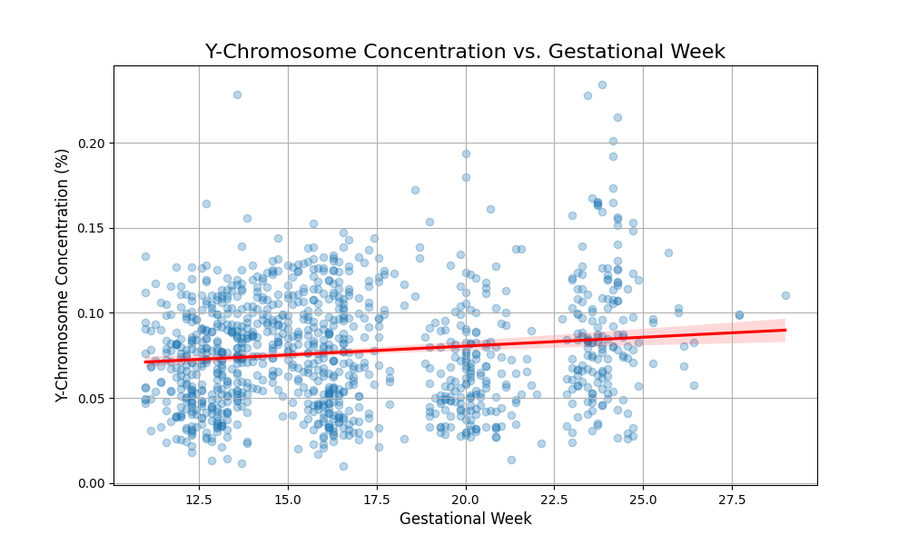
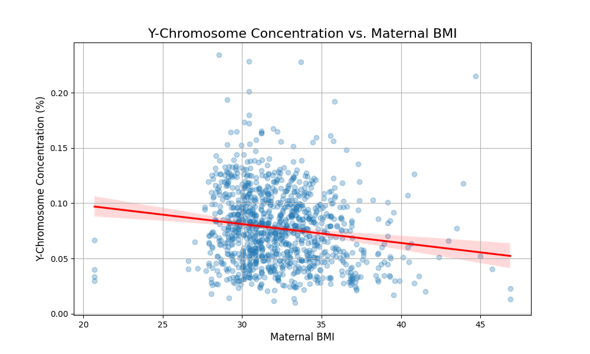
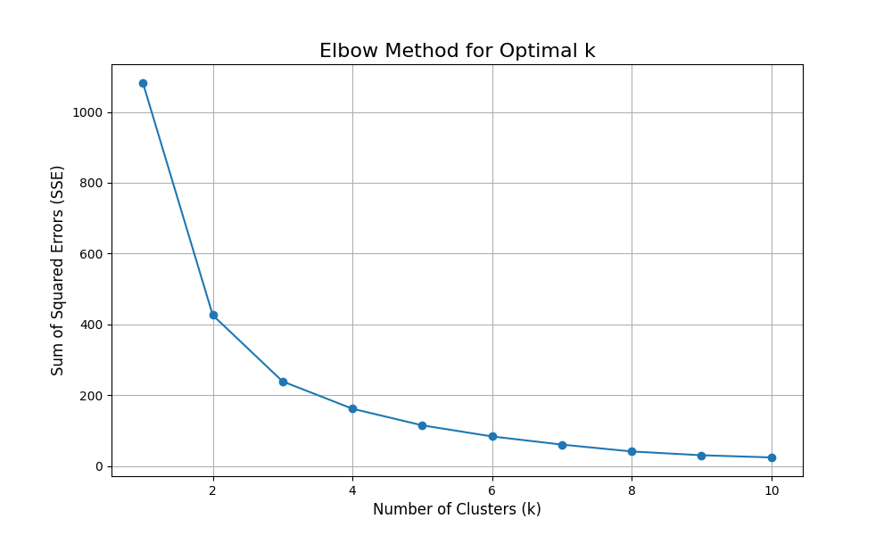
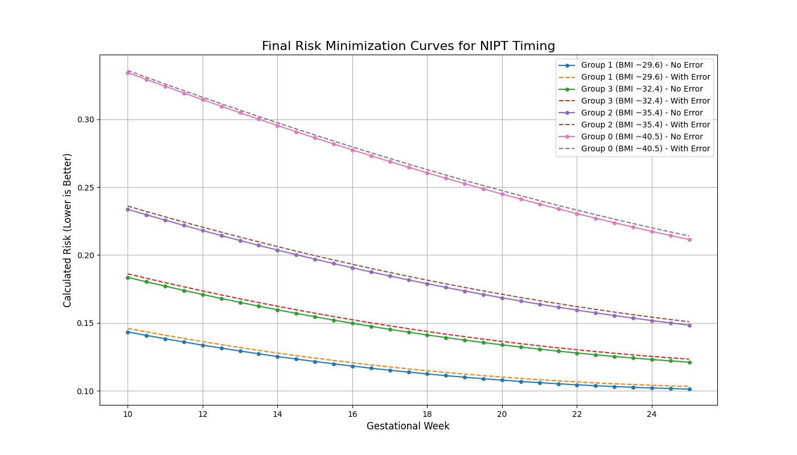
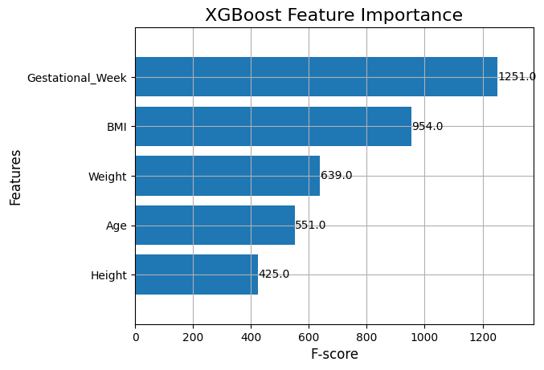
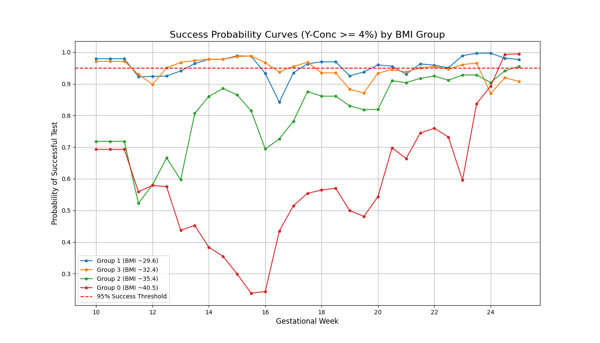
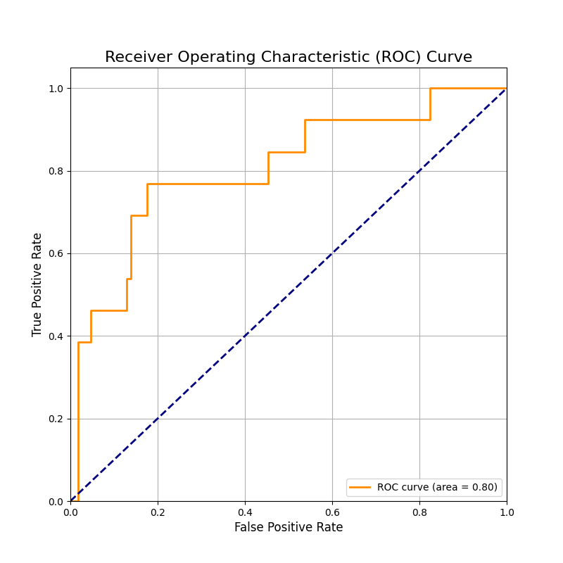
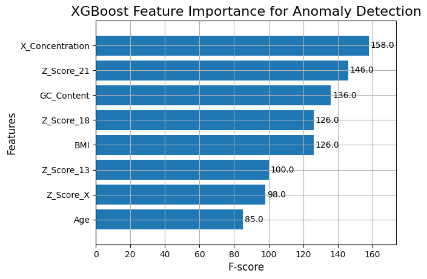

# NIPT Analysis Report

This report details the analysis of Non-Invasive Prenatal Test (NIPT) data to determine optimal testing times and build a model for anomaly detection.

---

## Problem 1: Y-Chromosome Concentration Modeling

The first step of the analysis was to understand the relationship between the concentration of Y-chromosome DNA fragments in the mother's blood and other key variables, namely the gestational week and the mother's Body Mass Index (BMI).

### Exploratory Data Analysis

To visualize these relationships, we created two scatter plots.

1.  **Y-Chromosome Concentration vs. Gestational Week:** This plot shows a positive, albeit noisy, correlation. As the gestational week increases, the concentration of Y-chromosome fragments tends to increase.

    

2.  **Y-Chromosome Concentration vs. Maternal BMI:** This plot shows a negative correlation. As the mother's BMI increases, the concentration of Y-chromosome fragments tends to decrease. This suggests that the fetal DNA is more diluted in mothers with a higher BMI.

    

### Regression Analysis

To quantify these relationships, we built a multiple linear regression model. The model aims to predict the Y-chromosome concentration based on gestational week and BMI.

**Model Equation:**
`Y-Concentration = Intercept + β1 * Gestational_Week + β2 * BMI`

**Results:**

The regression analysis confirmed the observations from the plots:
- **Gestational Week:** The coefficient was positive and statistically significant (p < 0.001), confirming that Y-chromosome concentration increases with gestational age.
- **BMI:** The coefficient was negative and statistically significant (p < 0.001), confirming that Y-chromosome concentration decreases as BMI increases.

The overall model was statistically significant (F-statistic p < 0.001) but had a low R-squared value of **0.046**. This indicates that while gestational week and BMI are significant predictors, they only explain about 4.6% of the variance in Y-chromosome concentration. Other factors, not included in this simple model, play a large role.

We also tested a model with an interaction term between gestational week and BMI, but the interaction was not statistically significant (p = 0.237), so the simpler model is preferred.

---

## Problem 2: BMI-Based NIPT Timing

The goal of this problem was to group pregnant women by their BMI and determine the optimal NIPT timing for each group to minimize risk. The risk is a combination of two factors: testing too early and having the test fail due to low Y-chromosome concentration, and testing too late, which shortens the window for clinical action.

### BMI Clustering

We used the K-Means clustering algorithm to partition the patients into distinct BMI groups. To find the optimal number of groups (k), we used the Elbow Method, which looks for the "elbow" point where adding more clusters doesn't significantly reduce the sum of squared errors.

The elbow plot suggested that k=4 is a reasonable choice for the number of clusters. Based on this, we grouped the patients into four distinct BMI categories.

### Risk Minimization

We defined a risk function to find the best NIPT week:
`Total Risk = w1 * P(test_failure) + w2 * delay_penalty`

-   `P(test_failure)` is the probability of the Y-chromosome concentration being below the required 4% threshold. This was estimated using the linear regression model from Problem 1.
-   `delay_penalty` is a linearly increasing penalty for each week of delay.

We also analyzed the impact of a potential measurement error of 0.5% in the Y-concentration reading by running a Monte Carlo simulation.

### Results and Limitations

The analysis consistently recommended the latest possible testing week (25 weeks). This is an unrealistic outcome and points to a limitation in our model. The simple linear regression from Problem 1, while statistically significant, has very low predictive power (R-squared of 4.6%). It fails to accurately capture the probability of a test failing, especially in the crucial early weeks.

**Conclusion for Problem 2:** While we successfully grouped patients by BMI, the risk minimization analysis is highly sensitive to the accuracy of the underlying predictive model. The results highlight the need for a more powerful model to get reliable NIPT timing recommendations. This will be the focus of Problem 3.

---

## Problem 3: Multi-Factor NIPT Timing with an Advanced Model

To overcome the limitations of the simple linear model, we developed a more sophisticated approach using a gradient boosting machine (XGBoost). This model was trained on an expanded set of features, including the mother's age, height, and weight, in addition to gestational week and BMI.

### Feature Importance

The trained XGBoost model allows us to identify which factors are most influential in predicting Y-chromosome concentration.

As shown in the plot, gestational week and BMI remain the most important predictors, but other factors like weight and age also contribute to the model's predictions.

### Success Probability Thresholding

Instead of a complex risk function, we used a more direct, success-oriented method. We defined the optimal NIPT time as the earliest gestational week where the **probability of the Y-chromosome concentration being >= 4% is at least 95%**. This provides a high-confidence window for testing.

The plot below shows the probability of a successful test over time for each of our four BMI groups.

### Recommended NIPT Timings (Multi-Factor Model)

This more robust analysis yields much more clinically relevant recommendations:

-   **Low BMI Groups (mean BMI ~29.6 and ~32.4):** Recommended NIPT at **10.0 weeks**. These women have a high probability of a successful test result even at the very beginning of the testing window.
-   **Medium-High BMI Group (mean BMI ~35.4):** Recommended NIPT at **25.0 weeks**.
-   **High BMI Group (mean BMI ~40.5):** Recommended NIPT at **24.5 weeks**.

These results clearly show that women with higher BMIs should wait significantly longer for their NIPT test to ensure the fetal DNA concentration is sufficient for an accurate result. This data-driven approach provides a much more personalized and reliable schedule than a one-size-fits-all recommendation.

---

## Problem 4: Female Fetus Anomaly Detection

The final problem focuses on building a model to identify female fetuses with a high risk of chromosomal anomalies. Unlike male fetuses, where Y-chromosome presence is a clear marker, female fetus analysis relies on more subtle statistical signals in the data.

### Classification Model

We built an `XGBClassifier` model to distinguish between normal and abnormal cases. The model was trained on a variety of features, including the Z-scores of chromosomes 13, 18, and 21, the mother's BMI and age, and the X-chromosome concentration.

Given the imbalanced nature of the data (far more normal than abnormal cases), we used a `scale_pos_weight` parameter to give more importance to correctly identifying the rare abnormal cases.

### Model Performance

The model's performance was evaluated on a held-out test set.

-   **AUC Score:** The model achieved an AUC score of **0.80**, indicating a good-but-not-perfect ability to differentiate between classes. The ROC curve below visualizes this performance.
-   **Recall (Sensitivity):** The most critical metric for a clinical test is recall—its ability to find all the true positive cases. Our model's recall for abnormal cases was **23%**. This means it correctly identified only about one in four of the actual anomalies, which is a significant limitation.
-   **Precision:** When the model did predict a case as abnormal, its precision was **60%**, meaning it was correct 3 out of 5 times.

### Key Predictive Features

The feature importance plot shows which factors the model found most useful for making its predictions.

The Z-scores for the key chromosomes (13, 18, 21, X) and the X-chromosome concentration are among the most powerful predictors, which aligns with clinical knowledge.

### Conclusion for Problem 4

We successfully built a model that can identify some abnormal cases with reasonable precision. However, its low sensitivity (recall) means it cannot be relied upon as a standalone diagnostic tool. In a real-world clinical setting, this model could serve as a preliminary screening tool to flag high-risk patients for further, more definitive testing, but it would miss a significant number of cases. Improving the recall, likely by acquiring more data on abnormal cases, would be the most critical next step.
